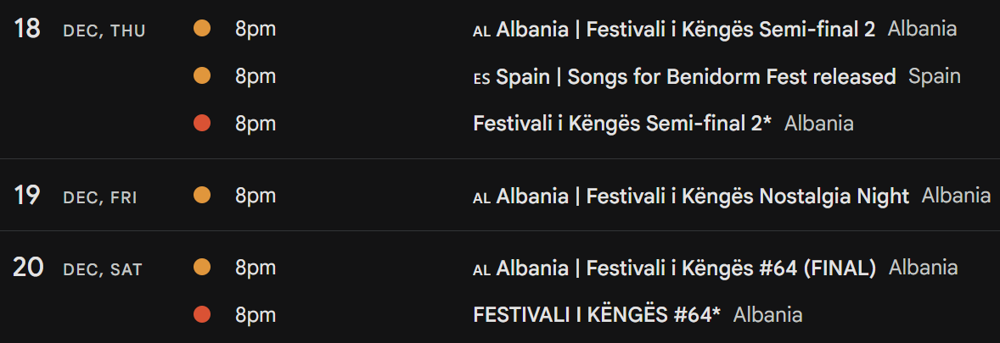

# Eurovision Calendar Generator
This script takes [Eurovisionworld's great Eurovision calendar](https://eurovisionworld.com/eurovision/calendar) and turns it into an .ics file, so it can be added to calendar apps. It is automatically regenerated every day.

Eurovisionworld already offers their calendar in .ics format, but it has some formatting decisions I personally don't like, and, most importantly, isn't as accurate as the one on the website. It only features national finals, not announcements, but even then, they sometimes miss a few.

_Here's a comparison of the two calendars.  |  🔴 Eurovisionworld - 🟡 This one_

## Add it now!
[`https://escfent.github.io/EurovisionCalendar/index.ics`](https://escfent.github.io/EurovisionCalendar/index.ics)

[Add to Google Calendar](https://www.google.com/calendar/render?cid=https%3A%2F%2Fescfent.github.io%2FEurovisionCalendar%2Findex.ics) - [Add to Office 365](https://outlook.office.com/calendar/0/addfromweb?url=https%3A%2F%2Fescfent.github.io%2FEurovisionCalendar%2Findex.ics&name=Eurovision%20Calendar%20(powered%20by%20Eurovisionworld.com)) - [Add to Outlook](https://outlook.live.com/calendar/0/addfromweb?url=https%3A%2F%2Fescfent.github.io%2FEurovisionCalendar%2Findex.ics&name=Eurovision%20Calendar%20(powered%20by%20Eurovisionworld.com))